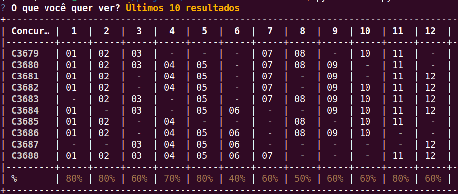

# Gerador de Estatísticas da Lotofácil

Busca todos os resultados da Lotofácil direto da API da Caixa, salva num CSV local e gera uma tabela no terminal mostrando quais dezenas saíram em cada concurso e a porcentagem de aparição de cada número no período selecionado.

Não busca dar ordem ao caos, foi feito apenas para praticar conceitos, testar bibliotecas e para mostrar ao meu pai quais números *não* jogar...



## O que faz

- Busca os resultados na API da Caixa e salva em CSV local
- Detecta automaticamente se o CSV está desatualizado
- Gera tabela no terminal com os últimos 10, 20 ou X concursos
- Mostra a porcentagem de aparição de cada dezena no período

## Stack

| Biblioteca |   |
|---|---|
| `httpx` | Cliente HTTP moderno, substituto do requests, com suporte nativo a async. |
| `asyncio` | Busca os concursos em paralelo. |
| `rich` | Tabela com cores no terminal. |
| `questionary` | Menu interativo. |

## Como rodar

```bash
git clone https://github.com/utf8-porfavor/lotofacil-estatisticas.git
cd lotofacil-estatisticas
python -m venv .venv
source .venv/bin/activate
pip install -r requirements.txt
python main.py
```

Na primeira execução o programa detecta que o CSV está vazio e oferece popular com todos os resultados disponíveis (aproximadamente 3600 concursos em Maio de 2026). As execuções seguintes baixam apenas os concursos novos.

## Estrutura

```
├── main.py       # menu e fluxo principal
├── busca.py      # consulta a API da Caixa
├── salva.py      # lê e escreve o CSV
├── gera.py       # monta a tabela com rich
└── requirements.txt
```